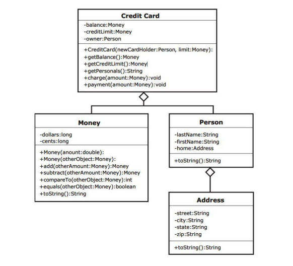

# BÀI THỰC HÀNH MÔN HỌC: NHẬP MÔN JAVA

## BÀI TH SỐ 2

Examine the UML diagram that follows. Notice that the instance fields in the ***CreditCard*** class are other types of objects, a ***Person*** object or a ***Money*** object. We can say that the ***CreditCard*** “has a” ***Person***, which means aggregation, and the ***Person*** object “has a” ***Address*** object as one of its instance fields. This aggregation structure can create a very complicated object. We will try to keep this lab reasonably simple.

To start with, we will be editing a partially written class, ***Money***. The constructor that you will be writing is a copy constructor. This means it should create a new object, but with the same values in the instance variables as the object that is being copied.

Next, we will write ***equals*** and ***toString*** methods. These are very common methods that are needed when you write a class to model an object. You will also see a ***compareTo*** method that is also a common method for objects.

After we have finished the ***Money*** class, we will write a ***CreditCard*** class. This class contains ***Money*** objects, so you will use the methods that you have written to complete the ***Money*** class. The ***CreditCard*** class will explore passing objects and the possible security problems associated with it. We will use the copy constructor we wrote for the ***Money*** class to create new objects with the same information to return to the user through the accessor methods.



## Task 1: Writing a Copy Constructor

1. Copy the files ***Address.java*** (code listing 9.1), ***Person.java*** (code listing 9.2), ***Money.java*** (code listing 9.3), ***MoneyDriver.java*** (code listing 9.4), and ***CreditCardDemo.java*** (code listing 9.5) from www.aw.com/cssupport or as directed by your instructor. ***Address.java***, ***Person.java***, ***MoneyDriver.java***, and ***CreditCardDemo.java*** are complete and will not need to be modified. We will start by modifying ***Money.java***

2. Overload the constructor. The constructor that you will write will be a copy constructor. It should use the parameter money object to make a duplicate money object, by copying the value of each instance variable from the parameter object to the instance variable of the new object.

## Task 2: Writing ***equals*** and ***toString*** methods

1. Write and document an ***equals*** method. The method compares the instance variables of the calling object with instance variables of the parameter object for equality and returns **true** if the dollars and the cents of the calling object are the same as the dollars and the cents of the parameter object. Otherwise, it returns **false**.

2. Write and document a ***toString*** method. This method will return a String that looks like money, including the dollar sign. Remember that if you have less than 10 cents, you will need to put a 0 before printing the cents so that it appears correctly with 2 decimal places.

3. Compile, debug, and test by running the ***MoneyDriver.java*** driver program. You should get the output:

```powershell
    The current amount is $500.00
    Adding $10.02 gives $510.02
    Subtracting $10.88 gives $499.14
    $10.02 equals $10.02
    $10.88 does not equal $10.02
```

## Task #3: Passing and Returning Objects

1. Create a ***CreditCard*** class according to the UML Diagram on the back. It should have data fields that include an **owner** of type ***Person***, a **balance** of type ***Money***, and a **creditLimit** of type ***Money***.

2. It should have a constructor that has two parameters, a ***Person*** to initialize the **owner** and a ***Money*** value to initialize the **creditLimit**. The **balance** can be initialized to a ***Money*** value of zero. Remember you are passing in objects (pass by reference), so you have passed in the address to an object. If you want your ***CreditCard*** to have its own **creditLimit** and **balance**, you should create a new object of each using the copy constructor in the ***Money*** class.

3. It should have accessor methods to get the balance and the available credit. Since these are objects (pass by reference), we don’t want to create an insecure credit card by passing out addresses to components in our credit card, so we must return a new object with the same values. Again, use the copy constructor to create a new object of type money that can be returned.

4. It should have an accessor method to get the information about the owner, but in the form of a String that can be printed out. This can be done by calling the **toString** method for the owner who is a ***Person***).

5. It should have a method that will charge to the credit card by adding the amount of Money in the parameter to the balance if it will not exceed the credit limit. If the credit limit will be exceeded, the amount should not be added, and an error message can be printed to the console.

6. It should have a method that will make a payment on the credit card by subtracting the amount of ***Money*** in the parameter from the **balance**.

7. Compile, debug, and test it out completely by running ***CreditCardDemo.java***. You should get the output:

```powershell
    Diane Christie, 237J Harvey Hall, Menomonie, WI 54751
    Balance: $0.00
    Credit Limit: $1000.00

    Attempt to charge $200.00
    Charge: $200.00
    Balance: $200.00
    Attempt to charge $10.02
    Charge: $10.02
    Balance: $210.02
    Attempt to pay $25.00
    Payment: $25.00
    Balance: $185.02
    Attempt to charge $990.00
    Exceeds credit limit
    Balance: $185.02
```

***Code Listing 9.1 (Address.java)***

```java
/** Defines an address using a street, city, state, and zipcode */
public class Address {
    /** The street number and street name */
    private String street;
    /** The city in which the address is located */
    private String city;
    /** The state in which the address is located */
    private String state;
    /** The zip code associated with that city and street */
    private String zip;

    /**
     * Constructor creates an address using four parameters
     * 
     * @param road    describes the street number and name
     * @param town    describes the city
     * @param st      describes the state
     * @param zipCode describes the zip code
     */
    public Address(String road, String town, String st,
            String zipCode) {
        street = road;
        city = town;
        state = st;
        zip = zipCode;
    }

    /**
     * toString method returns information about the address
     * 
     * @return all imformation about the address
     */
    public String toString() {
        return (street + ", " + city + ", " + state + " " +
                zip);
    }
}

```

***Code Listing 9.2 (Person.java)***

```java
/** Defines a person by name and address */
public class Person {
    /** The person’s last name */
    private String lastName;
    /** The person’s first name */
    private String firstName;
    /** The person’s address */
    private Address home;

    /**
     * Constructor creates a person from a last name,
     * first name, and address
     * 
     * @param last      the person’s last name
     * @param first     the person’s first name
     * @param residence the person’s address
     */
    public Person(String last, String first, Address residence) {
        lastName = last;
        firstName = first;
        home = residence;
    }

    /**
     * toString method returns information about the person
     * 
     * @return information about the person
     */
    public String toString() {
        return (firstName + " " + lastName + ", " +
                home.toString());
    }
}

```

## Code Listing 9.3 (Money.java)

```java
/** Objects represent nonnegative amounts of money */
public class Money {
    /** A number of dollars */
    private long dollars;
    /** A number of cents */
    private long cents;

    /**
     * Constructor creates a Money object using the amount of
     * money in dollars and cents represented with a decimal
     * number
     * 
     * @param amount the amount of money in the conventional
     *               decimal format
     */
    public Money(double amount) {
        if (amount < 0) {
            System.out.println("Error: Negative amounts " +
                    "of money are not allowed.");
            System.exit(0);
        } else {
            long allCents = Math.round(amount * 100);
            dollars = allCents / 100;
            cents = allCents % 100;
        }
    }

    /**
     * Adds the calling Money object to the parameter Money
     * object.
     * 
     * @param otherAmount the amount of money to add
     * @return the sum of the calling Money object and the
     *         parameter Money object
     */
    public Money add(Money otherAmount) {
        Money sum = new Money(0);
        sum.cents = this.cents + otherAmount.cents;
        long carryDollars = sum.cents / 100;
        sum.cents = sum.cents % 100;
        sum.dollars = this.dollars
                + otherAmount.dollars + carryDollars;
        return sum;
    }

    /**
     * Subtracts the parameter Money object from the calling
     * Money object and returns the difference.
     * 
     * @param amount the amount of money to subtract
     * @return the difference between the calling Money object
     *         and the parameter Money object
     */
    public Money subtract(Money amount) {
        Money difference = new Money(0);
        if (this.cents < amount.cents) {
            this.dollars = this.dollars - 1;
            this.cents = this.cents + 100;
        }
        difference.dollars = this.dollars - amount.dollars;
        difference.cents = this.cents - amount.cents;
        return difference;
    }

    /**
     * Compares instance variable of the calling object with
     * the parameter object. It returns -1 if the dollars and the
     * cents of the calling object are less than the dollars and
     * the cents of the parameter object, 0 if the dollars and the
     * cents of the calling object are equal to the dollars and
     * cents of the parameter object, and 1 if the dollars and the
     * cents of the calling object are more than the dollars and
     * the cents of the parameter object.
     * 
     * @param amount the amount of money to compare against
     * @return -1 if the dollars and the cents of the calling
     *         object are less than the dollars and the cents of the
     *         parameter object, 0 if the dollars and the cents of the
     *         calling object are equal to the dollars and cents of the
     *         parameter object, and 1 if the dollars and the cents of the
     *         calling object are more than the dollars and the cents of
     *         the parameter object.
     */
    public int compareTo(Money amount) {
        int value;
        if (this.dollars < amount.dollars) {
            value = -1;
        } else if (this.dollars > amount.dollars) {
            value = 1;
        } else if (this.cents < amount.dollars) {
            value = -1;
        } else if (this.cents > amount.cents) {
            value = 1;
        } else {
            value = 0;
        }
        return value;
    }
}

```

## Code Listing 9.4 (MoneyDriver.java)

```java
/** This program tests the money class. */
public class MoneyDriver {
    // This is a driver for testing the class
    public static void main(String[] args) {
        final int BEGINNING = 500;
        final Money FIRST_AMOUNT = new Money(10.02);
        final Money SECOND_AMOUNT = new Money(10.02);
        final Money THIRD_AMOUNT = new Money(10.88);
        Money balance = new Money(BEGINNING);
        System.out.println("The current amount is " + balance.toString());
        balance = balance.add(SECOND_AMOUNT);
        System.out.println("Adding " + SECOND_AMOUNT + " gives " + balance.toString());
        balance = balance.subtract(THIRD_AMOUNT);
        System.out.println("Subtracting " + THIRD_AMOUNT + " gives " + balance.toString());
        boolean equal = SECOND_AMOUNT.equals(FIRST_AMOUNT);
        if (equal) {
            System.out.println(SECOND_AMOUNT + " equals " + FIRST_AMOUNT);
        } else {
            System.out.println(SECOND_AMOUNT + " does not equal " + FIRST_AMOUNT);
        }
        equal = THIRD_AMOUNT.equals(FIRST_AMOUNT);
        if (equal) {
            System.out.println(THIRD_AMOUNT + " equals " + FIRST_AMOUNT);
        } else {
            System.out.println(THIRD_AMOUNT + " does not equal " + FIRST_AMOUNT);
        }
    }
}

```

## Code Listing 9.5 (CreditCardDemo.java)

```java
/** Demonstrates the CreditCard class */
public class CreditCardDemo {
    public static void main(String[] args) {
        final Money LIMIT = new Money(1000);
        final Money FIRST_AMOUNT = new Money(200);
        final Money SECOND_AMOUNT = new Money(10.02);
        final Money THIRD_AMOUNT = new Money(25);
        final Money FOURTH_AMOUNT = new Money(990);
        Person owner = new Person("Christie", "Diane", new Address("237J Harvey Hall","Menomonie", "WI", "54751"));
        CreditCard visa = new CreditCard(owner, LIMIT);
        System.out.println(visa.getPersonals());
        System.out.println("Balance: " + visa.getBalance());
        System.out.println("Credit Limit: " + visa.getCreditLimit());
        System.out.println();
        System.out.println("Attempt to charge " + FIRST_AMOUNT);
        visa.charge(FIRST_AMOUNT);
        System.out.println("Balance: " + visa.getBalance());
        System.out.println("Attempt to charge " + SECOND_AMOUNT);
        visa.charge(SECOND_AMOUNT);
        System.out.println("Balance: " + visa.getBalance());
        System.out.println("Attempt to pay " + THIRD_AMOUNT);
        visa.payment(THIRD_AMOUNT);
        System.out.println("Balance: " + visa.getBalance());
        System.out.println("Attempt to charge " + FOURTH_AMOUNT);
        visa.charge(FOURTH_AMOUNT);
        System.out.println("Balance: " + visa.getBalance());
    }
}
```
